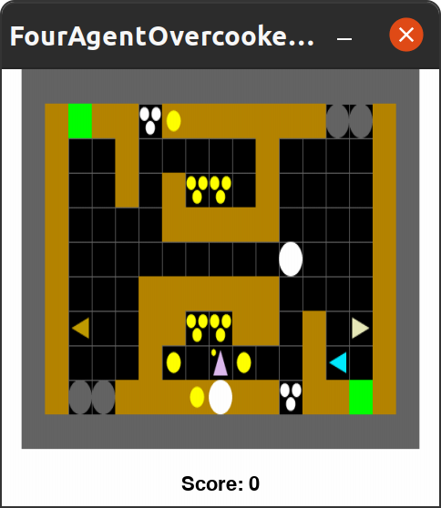

# N Agent Overcooked


Repository to set up and run Overcooked with an arbitrary number of agents and arbitrary layout design using [CoGrid](https://cogrid.readthedocs.io). CoGrid environments follow the PettingZoo `ParallelEnv` API.


## Getting Started

The primary dependency is `cogrid`, our library for creating multi-agent grid-based environments. We've included this in the `requirements.txt` file.

```bash
$ conda create -n n_agent_overcooked python=3.10
$ conda activate n_agent_overcooked
$ pip install -r requirements.txt
```

To run the environment and see it in action:

```bash
$ python n_agent_overcooked.py
```

This will visualize four random agents in a 4-agent Overcooked environment.

### Constructing the environment

CoGrid is based on a "registry" system, so everything
that could be part of an environment is defined as an object and registered in the CoGrid ecosystem:

- Objects: All "objects" that appear in the environment (a `GridObject`), are registered and have associated names and ASCII character representations. For Overcooked, this includes Pots, Onions, Delivery Zones,
Counters, etc. 
- Observation Spaces/Features: We also define the feature space through individually registered `Feature` classes, which have 
associated generator functions to build observations for each agent. Importantly, CoGrid observation spaces are `Dict` spaces, so we can define a feature space for each agent and track them by name. The `observations`output of `env.step()` is a `Dict` of `{agent_id: {"feature_name": feature_value}}`.
- Rewards: We also define individual `Reward` classes, which have associated generator functions to build rewards for each agent. Overcooked, by default, just uses a `delivery_reward` which is the typical common reward of +1 for all agents when a dish is delivered. In the original paper, they also use plating rewards and onion-in-pot rewards for reward shaping, which can be included here (see `n_agent_overcooked.py`). 
- Layout: We also define the layout of the environment, which is a constant layout that will be used to instantiate the environment from our registered ASCII layout. You could alternatively usa a "layout_fn", which could generate a layout dynamically.


All of the above are done already in the existing Overcooked implementation in CoGrid and we've demonstrated feature space construction in `overcooked_features.py`. Everything is brought together to construct an environment in `n_agent_overcooked.py`, which will display the environment shown below.



The rendering used here is inherited from Minigrid. Green squares are delivery zones, triangles are agents (pointed in the direction they're facing), the grey circles are pots, yellow circles are onions, white circles are plates, and the "piles" of each of the latter two appear as three smaller circles. All the tan squares are impassable counters, which objects can be placed on and picked up from.


### Action Space

The action space (with some more eloration and variation discussed in `n_agent_overooked.py`) is:

- `0`: Move Up
- `1`: Move Down
- `2`: Move Left
- `3`: Move Right
- `4`: Pick Up / Drop a held object
- `5`: Toggle/Interact (unused in Overcooked!)
- `6`: No-Op


### Human-AI Interaction Experiments (and prettier graphics)

The development of CoGrid accompanied [Interactive Gym](https://interactive-gym.readthedocs.io), a platform to turn Gym-style Python environments into web-based experiments. The benefit of this is Interactive Gym runs the Python environment directly in the browser, avoiding any reimplementation of the environment in JavaScript.We've used CoGrid and Interactive Gym together for our existing experiments, which you can see a demo of [at this link](http://janus.hss.cmu.edu:5704/). In Interactive Gym, we can run CoGrid environments and map the objects to sprites, which allows us to use Carroll et al.'s Overcooked sprite assets. 